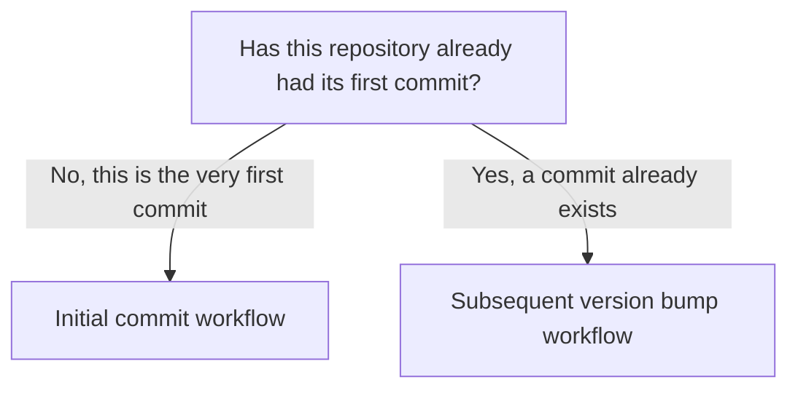

# Commit and Versioning Workflow

Version: 0.2.1
Status: Draft
Style Guide: style-guide--technical-documentation-for-technologists v0.2.0

## Abstract

This document describes the commit and versioning workflow for `osat-fluent-rclone-tool`. It covers two distinct paths, the initial commit for the repository, and every subsequent version bump after that, since the two do not follow the same steps or produce the same kind of commit message. It is intended for the project owner and any contributors.

## Which workflow applies to you



Clicking a box jumps to that section, in renderers that support mermaid click links. GitHub's own mermaid renderer strips click links for security, so on github.com the chart is still useful as a visual map, but the section headings below serve as the actual navigation.

If you are setting this repository up for the first time, use Initial commit workflow below. If a first commit already exists and you are releasing a new version, use Subsequent version bump workflow instead. The two paths share the same underlying tools, tag and push, but differ in what gets staged, what the commit message looks like, and whether `bump-version.py` is involved at all.

## Initial commit workflow

Use this path once, the first time this repository is committed. Every step after the first real commit belongs in Subsequent version bump workflow instead.

### Verify the branch

Confirm the repository is on `main` before making any commits:

```bash
git status
```

If not on `main`, create and switch to it:

```bash
git checkout -b main
```

### Stage and review

Stage all files:

```bash
git add .
git status
```

The `git status` output after staging is used directly in the commit message. For the initial commit, the expected output is something like:

```text
	renamed:    docs/en/README.md -> en/docs/README.md
	renamed:    osat-fluent-rclone-tool-commit-and-versioning-workflow.md -> en/docs/guides/osat-fluent-rclone-tool-commit-and-versioning-workflow.md
	new file:   en/docs/guides/syncing-systems-files-by-date-of-modification-using-rclone.md
	new file:   en/docs/guides/using-Includes-an-excludes-with-rclone-v0-1-0.md
	new file:   en/docs/guides/using-Includes-an-excludes-with-rclone-v0-1-1.md
	new file:   en/docs/guides/using-Includes-an-excludes-with-rclone-v0-1-3.md
```

This full file listing is expected only here, at the initial commit, when every file in the repository is new or freshly placed. It is not expected to appear again for ordinary version bumps, see Subsequent version bump workflow for what a normal commit message looks like instead.

### Commit

The commit message opens with a summary line, followed by the staged file list taken directly from `git status`.

```bash
git commit -m "Initial commit — v0.1.0
	renamed:    docs/en/README.md -> en/docs/README.md
	renamed:    osat-fluent-rclone-tool-commit-and-versioning-workflow.md -> en/docs/guides/osat-fluent-rclone-tool-commit-and-versioning-workflow.md
	new file:   en/docs/guides/syncing-systems-files-by-date-of-modification-using-rclone.md
	new file:   en/docs/guides/using-Includes-an-excludes-with-rclone-v0-1-0.md
	new file:   en/docs/guides/using-Includes-an-excludes-with-rclone-v0-1-1.md
	new file:   en/docs/guides/using-Includes-an-excludes-with-rclone-v0-1-3.md
"
```

### Tag and push

Apply the version tag. Use `-u` on this first push only, subsequent pushes on this branch use plain `git push`.

```bash
git tag v0.1.0
git push -u origin main
git push origin v0.1.0
```

Once this is done, the repository has its first commit, and every future release goes through Subsequent version bump workflow instead of this one.

## Subsequent version bump workflow

Use this path for every release after the initial commit. This is the workflow you will use almost every time.

### Bump the version

`bump-version.py` updates `VERSION` and `en/README.md`, stages both files, and prints the git commands needed to complete the release.

Check the current version

```bash
cat VERSION
```

Output example:

```bash
0.1.5
```

Compose your version bump command to be something like this

```bash
python3 bump-version.py 0.1.6 Draft "Brief description of change"
```

Realworld example

```bash
python3 bump-version.py 0.1.6 Draft "updated structure to en/docs same as sat and improved documentation for use case syncronise a directory by last date changes made"
```

### Stage and review

Confirm what was actually staged before committing, the file list for a version bump is small, typically just `VERSION` and `en/README.md`, not the full-repository listing seen at the initial commit.

```bash
git diff --staged
```

### Status check

```bash
git status
```

Output example:

```bash
	modified:   VERSION
	modified:   bump-version.py

Untracked files:
  (use "git add <file>..." to include in what will be committed)
	en/docs/guides/commit-and-versioning-workflow-v0-2-0.md
	en/docs/guides/commit-and-versioning-workflow-v0-2-1.md
```

Above I have some older document versions to delete

### Commit

The summary line describes the change and references the new version. The file list reflects whatever is actually staged for this bump, ordinarily just the two files `bump-version.py` touches.

```bash
git commit -m "Bump version to v0.1.6
	modified:   VERSION
	modified:   en/README.md
"
```

### Tag and push

```bash
git tag v0.1.1
git push
git push origin v0.1.1
```

## Notes

Once these processes are stable, agreed upon, and considered complete, this will be promoted to governance.

## Changelog

| Version | Status | Notes |
|---------|--------|-------|
| 0.2.1 | Draft | Added click-through links from the mermaid decision chart to the corresponding section anchors. Noted that GitHub's mermaid renderer strips click links, so they work in some renderers but not on github.com. |
| 0.2.0 | Draft | Restructured into two explicit workflows, initial commit and subsequent version bump, since the original single-path structure implied the full-repository commit message applied to every bump. Added a mermaid decision chart routing the reader to the correct workflow. |
| 0.1.0 | Draft | Initial draft |
